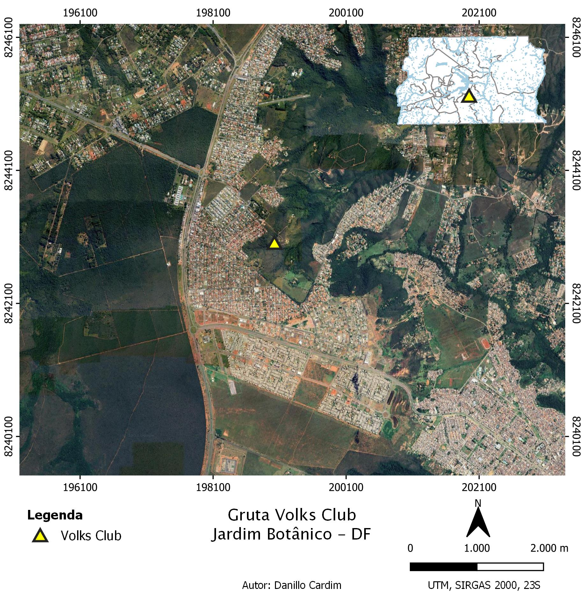
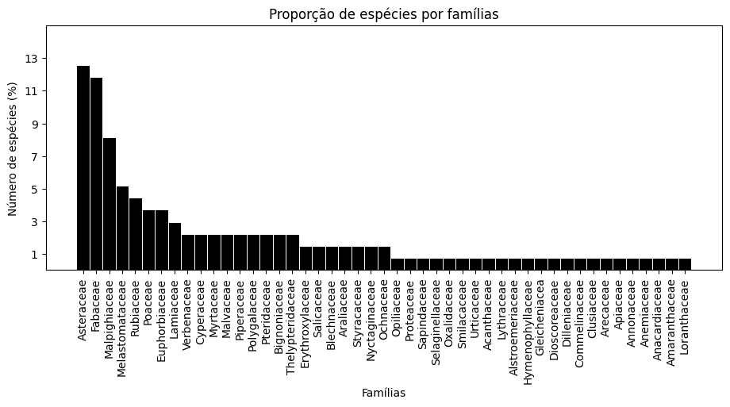

# Flora vascular da área de influência da Gruta Volks Club, Brasília, DF.
## Resumo
Os ambientes cavernícolas são relativamente estáveis do ponto de vista de temperatura e umidade, o que torna as cavernas muito sensíveis a distúrbios gerados pela antropização de áreas próximas. A Gruta Volks Club localizada no Jardim Botânico – DF é cercada por áreas residenciais e recebe visitas constantes da comunidade vizinha. Este fato torna sua conservação um desafio. Desta maneira, este trabalho visa contribuir com o entendimento da flora na área do entorno da caverna através de um levantamento florístico. Foram demarcadas duas parcelas de 20x20 m, uma em cada entrada da gruta, e foram coletadas todas as espécies. O levantamento apresentou 135 espécies distribuídas em 47 famílias botânicas, indicando que a composição florística não sofre influência direta do ambiente cavernícola e está com certo grau de conservação devido a diversidade de famílias e gêneros do cerrado.

## Caracterização da área
A Gruta Volks Club está localizada no Jardim Botânico, uma das Regiões Administrativas do Distrito Federal. Esta região fica dentro da Área Metropolitana de Brasília o que significa que é um local com alto grau de adensamento urbano (CODEPLAN, 2014). A gruta encontra-se na latitude 199021,79 m e na longitude 8243011,79 m no sistema UTM Sirgas 2000 23S, está cercado por condomínios residenciais e recebe visitas constantes da comunidade devido ao fácil acesso (SILVA, 2007; STUMPF & RIBEIRO, 2019) (Figura 1). 
O local de estudo pertence ainda a Área de Proteção Ambiental (APA) do São Bartolomeu que foi criada pelo Decreto Nº 88.940 de 1983 (BRASIL, 1983 – Decreto Federal Nº 88.940/83). Região que dentro do contexto do SNUC (Sistema Nacional de Unidades de Conservação) é caracterizada como uma unidade de uso sustentável.
A área de estudo está localizada no Planalto Central do Brasil e inserida no Bioma Cerrado. O clima é marcado por duas estações distintas: inverno seco e verão chuvoso. Recebe a classificação Aw de Köppen que é descrita como um clima tropical chuvoso (ALVARES et al., 2013). Segundo Bredt et al. (1999), a vegetação nas proximidades da gruta é composta por Mata de Galeria, Cerrado Sentido Restrito e Campo Sujo. 
A Gruta Volks Club se desenvolve em rochas siliclásticas do Grupo Paranoá que por sua vez encontra-se na zona externa da Faixa de Dobramentos Brasília (CAMPOS, 2004). O Grupo Paranoá tem caráter anquimetamórfico a facies xisto verde baixo (CAMPOS et al., 2013). Segundo Fonseca et al. (1995) é composto por metapelitos, metamargas e metarenitos que são rochas com dobras de diferentes dimensões que converge para leste.
O Grupo Paranoá possui subdivisões baseadas em um conjunto de camadas sedimentares. A Gruta Volks Club está inserida na camada denominada Formação Córrego do Sansão (informalmente também chamado de R4) que possui espessura entre 100 e 150 m (STUMPF & RIBEIRO, 2019). Esta formação é distinta pela presença de fáceis metarritimito argiloso (CAMPOS, 2004). Há uma preponderância da fração silte-argila, contudo também ocorrem estratos delgados de quartzitos rosados a avermelhados (STUMPF & RIBEIRO, 2019).
A Gruta Volks Club é classificada como gruta seca, todavia há um aumento no volume de água que corre no interior da caverna na estação chuvosa. Volume este que contribui na formação do córrego Taboca (COELHO, 2004). O local possui duas entradas separadas por uma distância horizontal de 84 m e um desnível de 11 m (STUMPF & RIBEIRO, 2019). A principal, que possui 6 m de comprimento e 3,5 m de altura, é onde encontra-se o sumidouro, e a segunda entrada, que possui 11 m de comprimento e 1,5 m de altura, é a ressurgência do córrego (COELHO, 2004; STUMPF & RIBEIRO, 2019).

## Análise de dados
Os espécimes coletados foram todos tabulados na plataforma computacional excel (flora_volks_dados.csv) e analisados com auxílio da linguagem de programação Python através do ambiente de desenvolvimento integrado (IDE) Visual Studio Code. Foram organizadas colunas com as informações da família botânica, gênero, epíteto específico, hábito, substrato e origem. As informações sobre hábito, substrato e origem foram obtidas através da plataforma Flora e Funga do Brasil (2023).
Os dados com as famílias, gênero, hábito e origem foram agrupados para análise da proporção percentual dentro de cada dado. A proporção de famílias e gêneros permitem a comparação com dados de levantamentos florísticos em outras manchas de cerrado. De acordo com número de famílias e gêneros presentes foi inferido a situação da área quando comparado com outros levantamentos. E a composição de famílias e gêneros permitiu inferir se a flora nas proximidades da Gruta Volks Club tem composição florística própria.
Os dados com os hábitos foram agrupados para análise da proporção entre espécies arbóreas, arbustivas e herbáceas. Esta informação demonstra o cenário da estrutura fitofisionômica do local. A proporção de espécies terrícolas e rupícolas foram calculados para conhecimento da preferência de substrato da comunidade vegetal.

## Resultados
O gráfico abaixo mostra o resultado da proporção de espécies por famílias botânicas encontradas na área.

